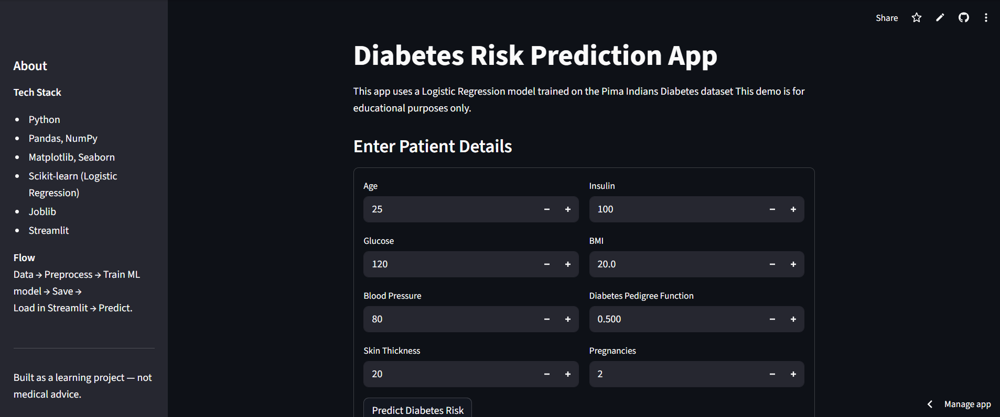

# Diabetes-Prediction-app

A simple end-to-end machine learning project that predicts diabetes risk using the Pima Indians Diabetes dataset and a Logistic Regression model.
This repo contains data preprocessing & training code, a saved model + scaler, and a Streamlit app to interact with the model and explore dataset insights.

# Project overview

Goal: Predict whether a person is likely to have diabetes (binary classification).

Model: Logistic Regression (scikit-learn).

Tech stack: Python, Pandas, NumPy, Matplotlib, Seaborn, scikit-learn, joblib, Streamlit.

Deliverables: training script, saved model & scaler, Streamlit app, documentation, demo-ready deployable app.

# Quick start — run locally

Clone

git clone https://github.com/<your-username>/diabetes-prediction-app.git

cd diabetes-prediction-app

Create & activate venv

python -m venv .venv

Windows (Git Bash)
source .venv/Scripts/activate

PowerShell
.venv\Scripts\Activate.ps1

Mac / Linux
source .venv/bin/activate

Install dependencies
pip install -r requirements.txt

Train model (optional if model.pkl already present)

python src/train_model.py

This will print evaluation metrics and create:

models/diabetes_model.pkl

models/scaler.pkl

Run Streamlit app

streamlit run app.py

Open http://localhost:8501 in your browser.

# What the training script does (src/train_model.py)

Loads data/diabetes.csv

Splits into train/test sets (stratified)

Scales features with StandardScaler (fit on train only)

Trains LogisticRegression with max_iter=1000

Evaluates on test set (accuracy, classification report, confusion matrix)

Saves scaler and model to models/ using joblib

# App features (app.py)

Load saved model & scaler

Interactive form: enter patient attributes (Pregnancies, Glucose, BloodPressure, SkinThickness, Insulin, BMI, DPF, Age)

Predict diabetes class & probability

Simple EDA: dataset head, descriptive stats, distribution plot (Glucose by Outcome)

Disclaimer: educational use only (not medical advice)

# Tips for improvements (next steps)

Add more preprocessing: missing-value imputation, outlier handling

Try different models: RandomForest, SVM, XGBoost

Add cross-validation & hyperparameter tuning (GridSearchCV)

Add feature importance visualization (coefficients, SHAP)

Create unit tests for preprocessing and prediction functions

CI/CD: GitHub Actions to run tests on push

# .gitignore (recommended)
.venv/
__pycache__/
*.pyc
models/*.pkl        # if you don't want to commit models, keep this entry
data/diabetes.csv   # if dataset is private; otherwise, include sample only

If you want to commit models/*.pkl for easy deployment, remove models/*.pkl from .gitignore.

# Evaluation metrics to report

Accuracy

Precision, Recall, F1-score (classification report)

Confusion matrix

AUC-ROC (optional, useful for imbalance)

# Screenshot

(assets/ss2.png)(assets/ss3.png)(assets/ss4.png)

# License

This project is licensed under the MIT License — feel free to reuse and modify.

# Contact / Credits

Built by Kashyap — feel free to connect on LinkedIn or open an issue on GitHub if you want help improving or deploying the project.
